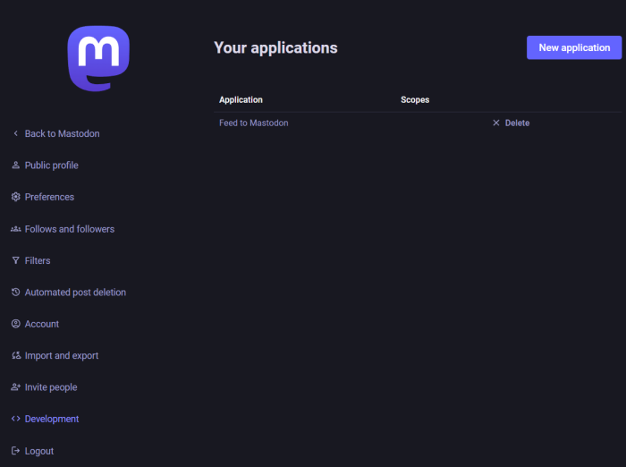
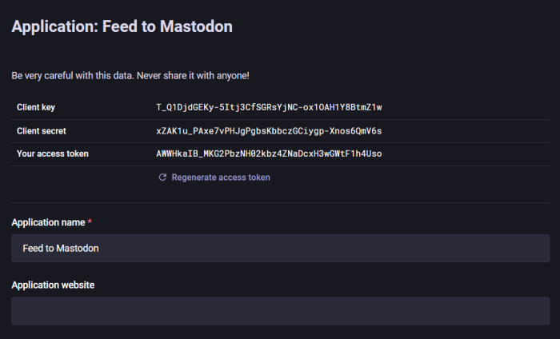

# Feed to Mastodon

`Feed to Mastodon` allows you to automatically posts news feed items to an Mastodon account.
It supports RSS, Atom and RDF feeds. You can configure multiple feeds, each with its own target
Mastodon account. It also supports GoToSocial as the Status-API is compatible to Mastodon.

For more informations, see this [Blog post](https://production-ready.de/2024/11/24/feed-to-mastodon-en.html)
([German version](https://production-ready.de/2024/11/24/feed-to-mastodon.html)).

You can see `Feed to Mastodon` working at [https://feedmirror.social](https://feedmirror.social/public/local)
with some feeds mirrored to the fediverse.


## Configuration

### Application configuration

Some settings are set for the whole application. This is done via an JSON file `appsettings.json`.

```json
{
  "Logging": {
    "LogLevel": {
      "Default": "Information"
    }
  },
  "DefaultWorkerLoopDelay": "00:01:00"
}
```

| Parameter                | Description                           | Values                            | Optional | Default       |
|--------------------------|---------------------------------------|-----------------------------------|----------|---------------|
| Logging:LogLevel:Default | The log level of the application      | `Debug`, `Information`, `Error`   | yes      | `Information` |
| DefaultWorkerLoopDelay   | The default delay between feed checks | format `hh:mm:ss` or `d.hh:mm:ss` | yes      | `00:01:00`    |

The file or the docker mount point must be located in the application directory.
This file is optional, if not present the default values are used.

### Feed configuration

The configuration of the individual feeds is done in a INI configuration file.

```ini
[heise.de]
feed_url = https://www.heise.de/rss/heise-atom.xml
summary_separator = [...]
tags = news technology
mastodon_server = https://mastodon.social/
mastodon_access_token = 1234567890
worker_loop_delay = 00:30:00
max_status_length = 500
default_language = en-US
```

| Parameter             | Description                                                                    |
|-----------------------|--------------------------------------------------------------------------------|
| feed_url              | URL of the feed, required                                                      |
| summary_separator     | Separator where the summary is cut off, see below, optional                    |
| tags                  | List of tags to add to each post, see below, optional                          |
| mastodon_server       | URL of the Mastodon server, required                                           |
| mastodon_access_token | Access token for the Mastodon account, required                                |
| worker_loop_delay     | Delay between feed checks, format `hh:mm:ss` or `d.hh:mm:ss`, optional         |
| max_status_length     | Maximum length of the Mastodon post, optional, default is 500, minimum is 100  |
| default_language      | Default post language, used if the feed has no language information, optional  |

The locations of the configuration file and the sqlite database are set via environment variables.

| Environment Variable | Description                                         |
|----------------------|-----------------------------------------------------|
| FTM_CONFIG_FILE_NAME | Absolute or relative path to the configuration file |
| FTM_DATABASE_NAME    | Absolute or relative path to the sqlite database    |

#### summary_separator

The `summary_separator` can be used to cut off the summary of the feed item at a certain point.
Some feeds stop there items with a elipis `...` or with a link to the original article. You can
configure the separator to cut off the summary at this point.

If an item has a summary like this
```
Earlier today, we reported that […]
To the post <a rel="nofollow" ...>http://news.com/123</a>
```

you can configure the separator as `[…]`:
```
Earlier today, we reported that ...
```

#### tags

Multiple `tags` can be added to each post, separated by space. On Mastodon, tags can contain
alphanumeric characters and underscores, but cannot contain numbers only.

```ini
tags = news technology opensource
```

#### max_status_length

The default maximum length of a Mastodon post is 500 characters. You can set a different value
if your instance offers a different maximum length.

```ini
max_status_length = 500
```

#### default_language

The default language used for the mastodon post if the feed has no language information.
If not set, the default value `en-US` is used.

```ini
default_language = en-US
```


## Run Feed to Mastodon

`Feed to Mastodon` is available as a Docker image at [Docker Hub](https://hub.docker.com/r/davidullrich/feed-to-mastodon).

### First run

To prevent that your Mastodon account is flooded with old feed items, the first run of
`Feed to Mastodon` will be recognized and mark all feed items as already posted. After that
all new feed items will be posted to Mastodon.

### 1. Create a Mastodon account and get an access token

First you need to create a Mastodon account or use an existing one. Then you need to create an
access token for this account. You can do this in the settings of your Mastodon account.

Go to `Preferences` -> `Development` and select `New application`. Enter a name, e.g.
`Feed to Mastodon` and select the scope `write:statuses`. This is the only scope that is needed.
You can unselect `profile`. Redirect URI can be the default `urn:ietf:wg:oauth:2.0:oob`.



After you created the application click on it and copy `Your access token`. This is the token you
need to put in the configuration file.



### 2. Create a configuration file

Create a configuration file `ftm-feed-config.ini` with the feeds you want to post to Mastodon.

```ini
[heise.de]
feed_url = https://www.heise.de/rss/heise-atom.xml
summary_separator = [...]
mastodon_server = https://mastodon.social/
mastodon_access_token = AWWHkaIB_...
```

Create an empty file `ftm.sqlite`.

### 3. Run the Docker image

``` bash
docker run -it --rm \
  -v "${PWD}/ftm-feed-config.ini:/app/ftm-feed-config.ini" \
  -v "${PWD}/ftm.sqlite:/app/ftm.sqlite" \
  -e "FTM_CONFIG_FILE_NAME=/app/ftm-feed-config.ini" \
  -e "FTM_DATABASE_NAME=/app/ftm.sqlite" \
  davidullrich/feed-to-mastodon:latest
```

### 4. Handle multiple feeds

You can add multiple feeds to the configuration file. Each feed will be posted to the corresponding
Mastodon account. You can use a different Mastodon account and `mastodon_access_token` for each feed
or use the same account for multiple feeds.

```ini
[heise.de]
feed_url = https://www.heise.de/rss/heise-atom.xml
summary_separator = [...]
mastodon_server = https://mastodon.social/
mastodon_access_token = AWWHkaIB_...
worker_loop_delay = 00:10:00
max_status_length = 500

[wired.com]
feed_url = https://www.wired.com/feed/rss
mastodon_server =  https://mastodon.social/
mastodon_access_token = ABC...
```

### 5. Run Feed to Mastodon with Docker Compose

To run `Feed to Mastodon` with docker compose you can use the following configuration.

```yaml
services:
  ftm:
    container_name: feed-to-mastodon
    image: davidullrich/feed-to-mastodon:latest
    restart: unless-stopped
    volumes:
      - ./data:/app/data
      - ./data/appsettings.json:/app/appsettings.json
    environment:
      - FTM_DATABASE_NAME=/app/data/ftm.sqlite
      - FTM_CONFIG_FILE_NAME=/app/data/ftm.ini
      - TZ=Europe/Berlin
```
